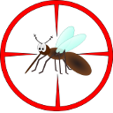

# SeqFileProcessing2D

## Introduction

The program detects small mosquitoes captured on camera and can track their motion.
The resulting data can then be further analysed to extract behavioural data.

The code is optimised for finding dark shadows of Mosquites on bright backgrounds. 
For recording the mosquito movement, we used [StreamPix](https://www.norpix.com/products/streampix/streampix.php) from NorPix which employ *.seq as their raw video file format.
Additionally, we added limited support for H.264, HEVC and MJPEG in mp4 container as input files.
We do not support B-frames for H.264 and HEVC encoded videos.    

This program was developed at the [School of Engineering](https://warwick.ac.uk/fac/sci/eng/) at the University of Warwick.

The program is used by our collaborators, the vector group from [Liverpool School of Tropical Medicine](https://www.lstmed.ac.uk/research/departments/vector-biology/vector-behaviour-and-genomics/mosquito-behaviour).
The algorithms are based on the [publication](https://royalsocietypublishing.org/doi/full/10.1098/rsif.2015.0974):

> Angarita-Jaimes, N. C., Parker, J. E. A., Abe, M., Mashauri, F., Martine, J., Towers, C. E., ... & Towers, D. P. (2016). 
> A novel video-tracking system to quantify the behaviour of nocturnal mosquitoes attacking human hosts in the field. 
> Journal of the Royal society Interface, 13(117), 20150974.

It incorporates enhancements for the detection of weak shadows with low signal to noise rations described in [publication](https://doi.org/10.1101/691949):

> Vitaly Voloshin, Christian Kröner, Chandrabhan Seniya, Gregory P. D. Murray, Amy Guy, Catherine E. Towers, Philip J. McCall, David P. Towers. 
> Diffuse retro-reflective imaging for improved video tracking of mosquitoes at human baited bednets
> bioRxiv 691949; doi: https://doi.org/10.1101/691949

This implementation uses the following open source projects:
 1. [Qt](https://qt.io)
 1. [icu](http://site.icu-project.org/)
 1. [ffmpeg](https://www.ffmpeg.org/)
 1. [opencv](https://opencv.org/)

## Build
### Building on Debian Buster:
Installation of necessary requirements: 
```
apt install -y libopencv-dev qt5-default build-essential libicu-dev libavdevice-dev libqt5charts5-dev
```
SeqFileProcessing2D can be built and installed  using:

```
git clone https://github.com/kroener/SeqFileProcessing2D
cd SeqFileProcessing2D
mkdir build
cd build
qmake ..
make
make install
```

### Windows binaries can be created with [mxe](https://mxe.cc/) (which can also run inside a WSL Debian image or Linux):
 1) get mxe, get dependencies and build opencv qtbase ffmpeg qtcharts using MXE_TARGET='x86_64-w64-mingw32.static' as a make flag:
```
git clone https://github.com/mxe/mxe.git
cd mxe/
apt install -y autoconf automake autopoint bash bison bzip2 flex g++ g++-multilib \
gettext git gperf intltool libc6-dev-i386 libgdk-pixbuf2.0-dev libltdl-dev \
libssl-dev libtool-bin libxml-parser-perl lzip make openssl p7zip-full patch \
perl pkg-config python ruby sed unzip wget xz-utils
make MXE_TARGETS='x86_64-w64-mingw32.static' opencv qtbase ffmpeg qtcharts
```

 2) export Path: 
```
export PATH=pathToMxe/usr/bin/:$PATH
```
 3) Build the windows binaries analog to the steps described for Debian above but using `x86_64-w64-mingw32.static-qmake-qt5` instead of qmake, leaving out the make install step and just use the `SeqFileProcessing.exe` file on Windows.

## Documentation
A quick overview of segmentation and tracking parameters is given in the [documentation.md](documentation.md).

## Funding
This research was supported with funding from the UK Medical Research Council (MRC) and
the UK Department for International Development (DFID) under the MRC/DFID Concordat
agreement (MR/M011941/1), a Wellcome Trust Collaborative Award (Malaria in Insecticide
Resistant Africa MiRA; 200222/Z/15/Z) and the Bill & Melinda Gates Foundation (OPP1159078).
